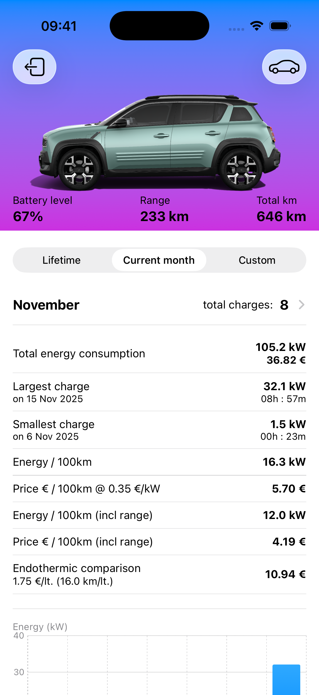
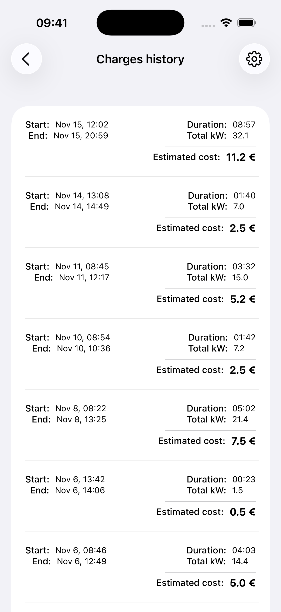
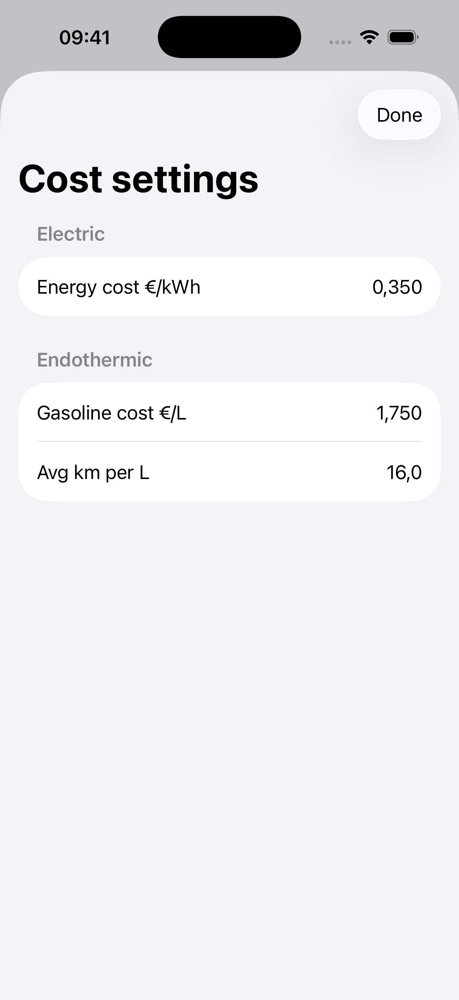
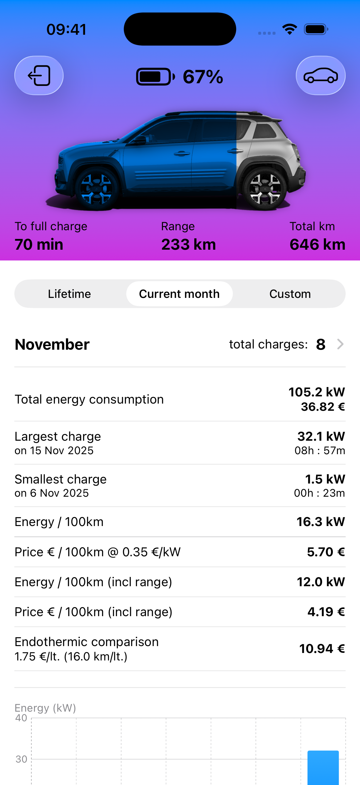
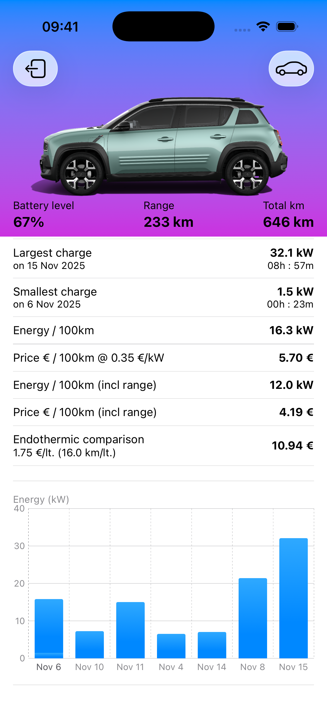

# OpenRenault EV Swift API Client

**OpenRenaultEV** is an open-source Swift implementation of the unofficial Renault / Kamereon / Gigya APIs that power the official MyRenault mobile experience. The project exposes models, view models, and SwiftUI tooling to fetch electric-vehicle telemetry such as charge history, battery status, HVAC state, and cockpit data for Renault EVs (Zoe, Megane E-Tech, Twingo EV, etc.).  

This repository is built as a full SwiftUI app so it can act both as a developer reference and as a ready-to-run dashboard. The goal is to offer a transparent, extensible, modern codebase for hobbyists, data nerds, and EV fleet owners who want to integrate Renault data into their own projects or contribute to the community.

---

## Why this project?

- 🚗 **Renault EV telemetry, decoded** – Ready-to-use models (`Kamereon*`, `Gigya*`, `VehicleLink`) and view models encapsulate login flows, account management, and charge-history calculations.  
- 📊 **Rich SwiftUI dashboard** – Visualize number of charges, kWh recovered, cost comparisons, and per-100-km efficiency using Swift Charts.  
- 🧠 **EV cost analytics** – Built-in calculators compare electricity vs. fuel costs and support user-defined energy/gas prices via persistent settings.  
- 🔐 **Gigya-auth flow included** – Credential handling, session persistence, and error surfacing are all handled by `MyRenaultOpenAPIViewModel`.  
- 🔌 **Composable API abstraction** – `MyRenaultOpenAPI` bundles REST calls and JSON handling with preview-friendly helpers.  

---

## Features

- **Authentication** against Renault’s Gigya endpoints with secure keychain storage.  
- **Account & vehicle selection** with persistent state across launches.  
- **Charge history analytics** with largest/smallest session detection, total kWh, per-100 km efficiency, and cost comparisons.  
- **Custom date ranges** (current month, lifetime, arbitrary range) with per-range charge history fetches.  
- **Charging charts** using Swift Charts to render per-day energy recovery.  
- **Vehicle switching sheet** for quick VIN changes without rerunning onboarding.  
- **Settings for energy and gasoline cost** persisted with `AppStorage`.  
- **Preview-friendly design** with snapshot caching to avoid network calls.  

---

## Screenshots

| Dashboard | Charge History | Settings |
|-----------|----------------|----------|
|  |  |  |

| Charging status | Charts |
|-----------------|--------|
|  |  |

---

## Getting Started

### Requirements

- Xcode 15 or newer  
- Swift 5.9+  
- A Renault account with vehicles linked to the MyRenault app  
- API keys (from traffic inspection or developer credentials) for Gigya and Kamereon  

### Setup

1. **Clone the repository**  
   ```bash
   git clone https://github.com/YOUR-ORG/MyRenault.git
   cd MyRenault
   ```

2. **Open the project**  
   ```bash
   open MyRenault.xcodeproj
   ```

3. **Configure API keys**  
   In `MyRenault/MyRenaultOpenAPIViewModel.swift` and `MyRenault/MyRenaultOpenAPI.swift`, replace the placeholder Gigya/Kamereon URLs and keys with your own.  

4. **Run the app**  
   Select an iOS simulator or device and press `⌘R`.

> ⚠️ _Disclaimer: Renault’s APIs are undocumented and may change at any time. Use responsibly, respect terms of service, and do not overload the endpoints._

---

## Repository Structure

```
MyRenault/
├─ MyRenaultApp.swift            # App entry point and dependency injection
├─ ContentView.swift             # Main SwiftUI surface + dashboards
├─ Views/                        # SwiftUI components (charts, settings, switcher)
├─ ViewModels/                   # Observable view models and data orchestration
├─ Models/                       # Codable models for Gigya/Kamereon payloads
├─ Helpers/                      # Cost settings, keychain storage, JSON helpers
├─ MyRenaultOpenAPI.swift        # REST client for Gigya/Kamereon APIs
└─ README.md
```

---

## Roadmap / Ideas

- [ ] Background refresh & push notifications for charge completion.  
- [ ] Dynamic Island integration.
- [ ] Widgets for battery status and next charge schedule.
- [ ] CarPlay / watchOS companions.  
- [ ] Export charge history as CSV / JSON for further analysis.  
- [ ] MQTT/webhook integrations for home automation.  

Contributions are welcome—open an issue to discuss new features or submit a PR.

---

## Contributing

1. Fork the repo.  
2. Create a feature branch (`git checkout -b feature/awesome`).  
3. Commit and push your changes.  
4. Open a Pull Request with a clear description, screenshots (if UI), and tests where applicable.

Please follow the existing Swift style conventions and keep credentials out of the repo.

---

## License

This project is released under the MIT License. See [LICENSE](LICENSE) for details.

---

## Credits & Acknowledgements

- Inspired by the MyRenault community and numerous reverse-engineering efforts across forums and GitHub.  
- Built with SwiftUI, Swift Charts, and lots of curiosity about EVs.

If you find this useful, give the repo a ⭐️ and share it with fellow Renault EV owners!
